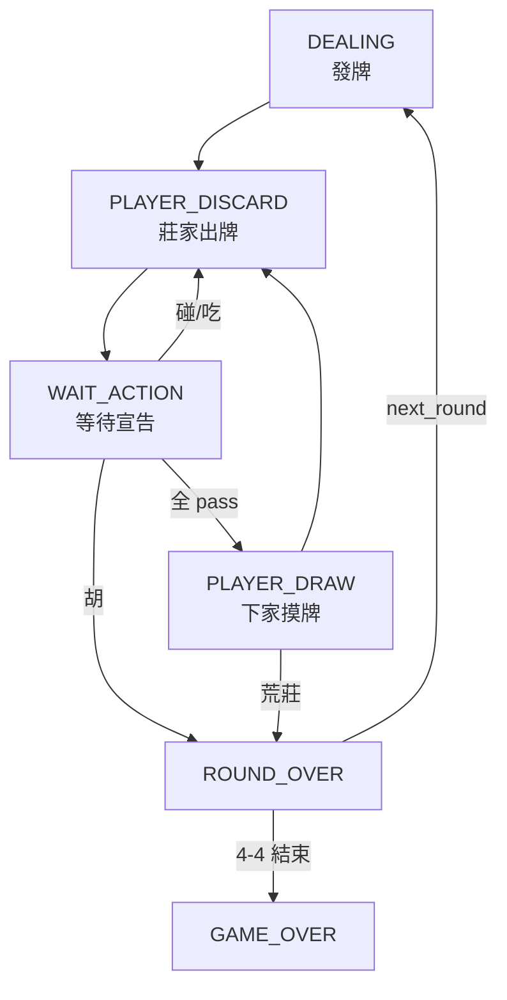

# 補全遊戲進行中 Player 1-4 等待/互動流程

## 變更概覽

本次補全了麻將遊戲狀態機中所有缺失的環節，使遊戲能在 4 位玩家（真人+AI）之間完整循環。

## 變更檔案

### 新增檔案

| 檔案 | 用途 |
|------|------|
| [game_loop.go](file:///d:/GoProjects/webMajiangGame/controllers/game_loop.go) | 遊戲主循環控制器，負責 AI 自動宣告、結算後推進、AI 摸牌出牌 |

### 修改檔案

| 檔案 | 變更內容 |
|------|----------|
| [game.go](file:///d:/GoProjects/webMajiangGame/controllers/game.go) | 新增 [DrawTileAction](file:///d:/GoProjects/webMajiangGame/controllers/game.go#314-365) — 處理 PLAYER_DRAW→PLAYER_DISCARD（含荒莊檢查） |
| [game_ai_turn.go](file:///d:/GoProjects/webMajiangGame/controllers/game_ai_turn.go) | 重構為透過 game_loop 函式整合狀態機 |
| [ws_handler.go](file:///d:/GoProjects/webMajiangGame/controllers/ws_handler.go) | 補齊 8 個缺失的 WebSocket 路由，出牌後自動觸發 AI 推進 |
| [api.md](file:///d:/GoProjects/webMajiangGame/api.md) | 更新完整文件，含狀態機流程圖 |

## 核心新增函式

### [game_loop.go](file:///d:/GoProjects/webMajiangGame/controllers/game_loop.go) 中的關鍵函式

- **[RunPostDiscard](file:///d:/GoProjects/webMajiangGame/controllers/game_loop.go#11-75)** — 出牌後觸發：收集 AI 宣告 → 等待真人 → 結算 → 推進
- **[RunPostResolve](file:///d:/GoProjects/webMajiangGame/controllers/game_loop.go#76-128)** — 結算後觸發：判斷下家是真人還是 AI，自動推進 AI 回合
- **[ProcessAIResponse](file:///d:/GoProjects/webMajiangGame/controllers/game_loop.go#129-166)** — AI 對他人出牌的自動判斷（能胡→hu, 能碰→pong, 否則→pass）
- **[runAIDrawAndDiscard](file:///d:/GoProjects/webMajiangGame/controllers/game_loop.go#167-212)** — AI 摸牌+自摸檢查+出牌
- **[runAIDiscard](file:///d:/GoProjects/webMajiangGame/controllers/game_loop.go#213-234)** — AI 出牌+觸發 RunPostDiscard

### [game.go](file:///d:/GoProjects/webMajiangGame/controllers/game.go) 新增

- **[DrawTileAction](file:///d:/GoProjects/webMajiangGame/controllers/game.go#314-365)** — PLAYER_DRAW 階段的正式控制函式（含牌堆耗盡→荒莊流局）
